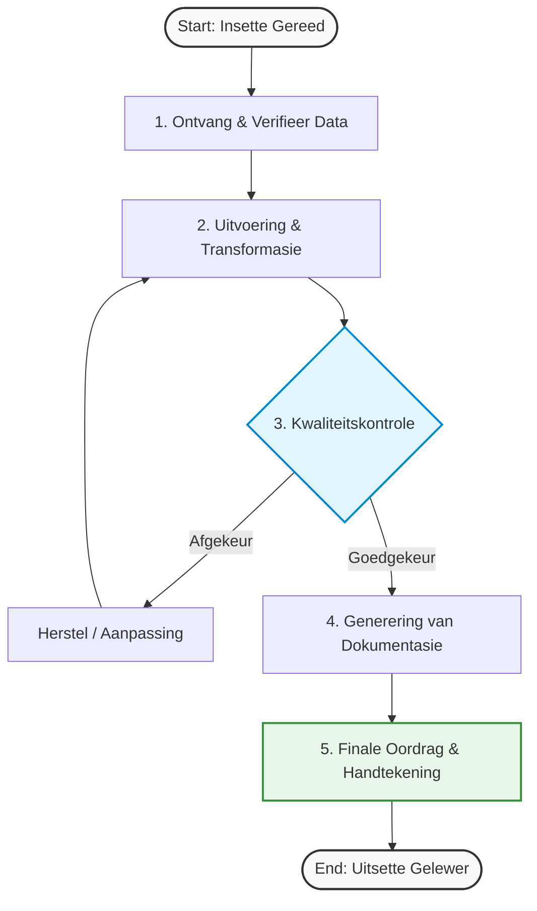

# Feature Branch in Lockstep with `main`

This guide elaborates your visual process as a **feature-branch delivery model** that stays separate from `main`, while continuously synchronized with `main` (lockstep).

---

## Goal

Use a dedicated feature branch for changes, but keep it current with `main` so integration risk stays low.

- **Isolation:** Work happens on `feature/...` and never directly on `main`.
- **Lockstep:** Frequently pull/rebase from `main` so drift is minimal.
- **Traceability:** SIPOC + workflow artifacts remain versioned in the feature branch.

---

## 1) SIPOC (High-Level Scope)

The SIPOC defines boundaries before detailed execution.

### ASCII System Map

```text
 +-----------------+     +-----------------+     +-----------------+
 |    SUPPLIERS    | --> |     INPUTS      | --> |    PROCESS      |
 |  (Verskaffers)  |     |     (Insette)   |     |    (Proses)     |
 +-----------------+     +-----------------+     +-----------------+
   - Raw Materials         - Specifications        - 1. Receive/Check
   - Engineering Data      - Energy / Utilities    - 2. Transform/Proc
   - Client Requests       - Component Parts       - 3. Verify/Test
                                                          |
                                                          v
 +-----------------+     +-----------------+     +-----------------+
 |    CUSTOMERS    | <-- |     OUTPUTS     | <-- |    PROCESS      |
 |   (Klënte)      |     |    (Uitsette)   |     |   (Voltooiing)  |
 +-----------------+     +-----------------+     +-----------------+
   - End User / Plant      - Finished Product      - 4. Package/Doc
   - Quality Assurance     - Validation Docs       - 5. Release/Handover
   - Project Sponsor       - Performance Data
```

---

## 2) Workflow (Detailed)

The workflow expands SIPOC process steps and includes QA decision/rework loop.

### ASCII Flow

```text
 [ Start ]
     |
     v
+---------------------------+
| 1. Ontvang Insette & Data |
+---------------------------+
     |
     v
+---------------------------+
| 2. Uitvoering & Proses    |
+---------------------------+
     |
     v
+---------------------------+
| 3. Kwaliteitstoets (QA)   |
+---------------------------+
     |
     v
    / \
   /   \
  / OK? \  ----( Nee )----> [ Herstel / Aanpassing ]
  \     /                         |
   \   /                          |
    \ /                           |
     | (Ja)                       |
     v                            |
+---------------------------+     |
| 4. Dokumentasie & Pakket  | <---+
+---------------------------+
     |
     v
+---------------------------+
| 5. Finaal & Oordrag (HO)  |
+---------------------------+
     |
     v
  [ End ]
```

---

## 3) Mermaid.js Syntax



---

## 4) Branching Operating Model (Lockstep)

Use this operating pattern to keep your feature branch aligned with `main`.

### Branch setup

```bash
git checkout main
git pull origin main
git checkout -b feature/sipoc-workflow-progressie
```

### Daily lockstep cycle

```bash
git fetch origin
git checkout feature/sipoc-workflow-progressie
git rebase origin/main
# resolve conflicts if any
git push --force-with-lease
```

### Integration gates

1. **QA gate:** QA must pass before merge.
2. **Documentation gate:** SIPOC + workflow artifacts updated.
3. **Review gate:** PR approved.
4. **Freshness gate:** Branch rebased onto latest `origin/main` right before merge.

### Why this works

- Small, frequent rebases reduce merge debt.
- Mainline remains stable.
- The feature remains auditable with process visuals and QA checkpoints.

---

## 5) HTML/CSS Render (SVG-Style PDF Preview)

Save the following as `progressie.html`, then print/save as PDF.

```html
<!DOCTYPE html>
<html lang="af">
<head>
<style>
    body {
        font-family: 'Segoe UI', Helvetica, Arial, sans-serif;
        color: #333;
        line-height: 1.6;
        padding: 20px;
        background-color: #ffffff;
    }
    .page-container {
        max-width: 850px;
        margin: 0 auto;
        border: 1px solid #e0e0e0;
        padding: 40px;
        background: #fff;
        box-shadow: 0 4px 6px rgba(0,0,0,0.05);
    }
    h1 {
        text-align: center;
        color: #1a365d;
        border-bottom: 2px solid #e2e8f0;
        padding-bottom: 15px;
        text-transform: uppercase;
        font-size: 24px;
        letter-spacing: 1px;
    }
    h2 {
        color: #2b6cb0;
        font-size: 18px;
        margin-top: 30px;
        border-left: 4px solid #2b6cb0;
        padding-left: 10px;
    }
    .sipoc-table {
        width: 100%;
        border-collapse: collapse;
        margin: 20px 0;
        font-size: 13px;
    }
    .sipoc-table th {
        background-color: #2b6cb0;
        color: white;
        font-weight: 600;
        text-transform: uppercase;
        padding: 12px;
        border: 1px solid #2b6cb0;
    }
    .sipoc-table td {
        padding: 12px;
        border: 1px solid #e2e8f0;
        vertical-align: top;
        background-color: #f7fafc;
    }
    .workflow-container {
        display: flex;
        flex-direction: column;
        align-items: center;
        margin: 30px 0;
    }
    .flow-node {
        background: #ffffff;
        border: 2px solid #4a5568;
        border-radius: 6px;
        padding: 15px 25px;
        width: 280px;
        text-align: center;
        font-weight: bold;
        box-shadow: 0 2px 4px rgba(0,0,0,0.05);
        position: relative;
    }
    .flow-node.decision {
        border-radius: 50% / 12%;
        background: #ebf8ff;
        border-color: #3182ce;
        color: #2b6cb0;
    }
    .flow-node.success {
        background: #f0fff4;
        border-color: #38a169;
        color: #276749;
    }
    .flow-arrow {
        height: 30px;
        width: 2px;
        background-color: #4a5568;
        position: relative;
    }
    .flow-arrow::after {
        content: '';
        position: absolute;
        bottom: 0;
        left: -4px;
        border-width: 5px 5px 0 5px;
        border-style: solid;
        border-color: #4a5568 transparent transparent transparent;
    }
    .print-footer {
        margin-top: 50px;
        text-align: center;
        font-size: 11px;
        color: #a0aec0;
        border-top: 1px solid #e2e8f0;
        padding-top: 10px;
    }
</style>
<title>Visuele Progressie Preview</title>
</head>
<body>

<div class="page-container">
    <h1>Proses Progressie Dashboard</h1>

    <h2>1. SIPOC Kaart</h2>
    <table class="sipoc-table">
        <thead>
            <tr>
                <th>Suppliers</th>
                <th>Inputs</th>
                <th>Process</th>
                <th>Outputs</th>
                <th>Customers</th>
            </tr>
        </thead>
        <tbody>
            <tr>
                <td>• Data Verskaffers<br>• Ingenieurspanne<br>• Kliënt / Aanvraer</td>
                <td>• Spesifikasies<br>• Berekeninge<br>• Regulasies (PED/ISO)</td>
                <td><strong>1.</strong> Ontvang & Check<br><strong>2.</strong> Uitvoering<br><strong>3.</strong> QA Validering<br><strong>4.</strong> Dokumentasie<br><strong>5.</strong> Oordrag</td>
                <td>• Finale Stelsel<br>• Gehalteverslae<br>• Handover Pakket</td>
                <td>• Aanleg-Eienaar<br>• QA Ouditeure<br>• Eindgebruiker</td>
            </tr>
        </tbody>
    </table>

    <h2>2. Gedetailleerde Werkvloei (SVG-Styl)</h2>
    <div class="workflow-container">
        <div class="flow-node">1. Ontvang Insette & Data Verifikasie</div>
        <div class="flow-arrow"></div>

        <div class="flow-node">2. Uitvoering & Proses Transformasie</div>
        <div class="flow-arrow"></div>

        <div class="flow-node decision">3. Kwaliteitstoets & Review (QA)</div>
        <div class="flow-arrow"></div>

        <div class="flow-node">4. Dokumentasie & Data Samestelling</div>
        <div class="flow-arrow"></div>

        <div class="flow-node success">5. Finaal & Projek Handover (HO)</div>
    </div>

    <div class="print-footer">
        Gegenereer vir SVG/PDF Voorskou • Enkele Bron van Waarheid (SSoT)
    </div>
</div>

</body>
</html>
```

---

## 6) Quick PDF Steps

1. Copy the HTML block into `progressie.html`.
2. Open in Chrome/Edge/Firefox.
3. Press `Ctrl+P` (`Cmd+P` on macOS).
4. Choose **Save as PDF**.

