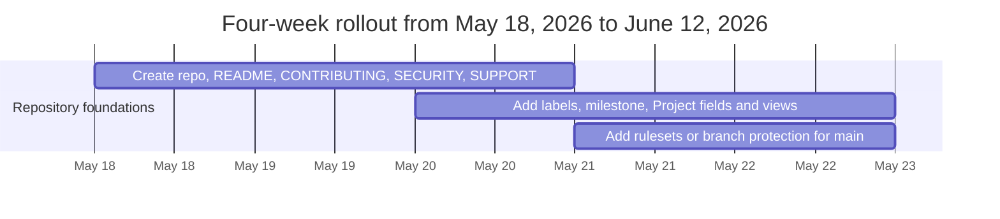

# GitHub-Centered Software Delivery From Project Start to First Production Release

This guide is the GitHub-focused companion to `GitHub_Reproducible_Build_Process.md`. Treat `GitHub_Reproducible_Build_Process.md` as the primary cross-platform baseline and use this document to apply GitHub-specific governance, workflow, and security defaults.

## Executive summary

For a new software project whose language and deployment platform are not yet fixed, the most robust approach is to make the repository itself the system of record for source, workflow, release evidence, and handoff documentation. In practice, that means establishing a small set of non-negotiable repository contracts on day one: a protected default branch, work tracked through issues and a Project, standardized pull requests, reproducible build commands behind a stable interface such as `make`, CI and security checks on every pull request, release tags that map cleanly to semantic versions, and environment-gated deployment workflows. GitHub’s own documentation supports this end-to-end model across GitHub Flow, Projects, rulesets/branch protection, Actions workflows, environments, release notes, and code ownership.

The recommended default branch strategy is **GitHub Flow with a protected `main` branch**, short-lived topic branches, pull requests for every change, squash merging, and Conventional Commits in either commit messages or at minimum the final squash-merge title. GitHub documents GitHub Flow as a lightweight branch-based workflow; GitHub also lets administrators require approving reviews, code-owner review, passing status checks, conversation resolution, signed commits, linear history, merge queues, and successful deployments before merge. Conventional Commits were designed to make history machine-readable and align naturally with Semantic Versioning, while Git documents annotated tags as the proper form of release tags.

Because the language is unspecified, the most defensible repository design is **language-agnostic at the workflow layer and language-specific at the script layer**. The CI pipeline should call a small, stable command contract such as `make bootstrap`, `make lint`, `make test`, `make build`, and `make package`; the implementation of those targets then depends on the selected ecosystem. Primary documentation across npm, pip/Python, Maven, .NET, Go, and Cargo all supports a lockfile- or wrapper-based reproducibility model, but the concrete mechanism differs by ecosystem. That difference is exactly why the repository should expose a consistent build interface while hiding language specifics behind scripts.

Security should be built into the baseline rather than added after the first release. GitHub’s native stack already covers dependency review, Dependabot updates, CodeQL code scanning, secret scanning, push protection, environment-scoped secrets, OIDC-based cloud authentication, and artifact attestations. The most important operational recommendation is to use GitHub-native controls wherever possible, because they are the most tightly integrated with pull requests, repository policy, and release auditability. The most important implementation recommendation is to pin Actions to full commit SHAs in hardened production repositories, because GitHub documents full-length SHA pinning as the only immutable way to reference an action release.

The remainder of this report therefore recommends a concrete, review-ready baseline: a repository blueprint, artifact inventory, branch and review policy, issue and PR templates, label and Project taxonomy, a language-agnostic build contract, sample GitHub Actions workflows, release-note configuration, deployment gates for dev/stage/prod, a comparison of CI/CD alternatives, and a four-week rollout plan mapped to relative **Week 1-Week 4** milestones.

## Operating model from inception to first production release

The operating model should begin before the first line of product code. Create the repository, make `main` the default branch, turn on Issues and Projects, add the community-health and governance files, and immediately protect `main` with pull-request reviews and required checks. GitHub documents GitHub Flow as a branch-based workflow in which work happens on branches and is reviewed before it reaches the default branch; GitHub also documents Projects as linked, automatically synchronized planning surfaces over issues and pull requests.

For a new project, the simplest workable branching policy is:

| Topic | Recommended default | Rationale |
|---|---|---|
| Default branch | `main` | Minimize permanent branches; keep one release line until backporting is actually needed. |
| Working branches | `feature/<issue>-<slug>`, `fix/<issue>-<slug>`, `chore/<issue>-<slug>`, `hotfix/<issue>-<slug>` | Keeps work traceable to GitHub issues and easy to search in PR history. |
| Merge method | **Squash merge** into `main` | Produces a clean, linear history and lets the PR title become the canonical Conventional Commit for the merge. |
| Release branches | Not at the start; add `release/*` only when servicing multiple supported versions | Avoids premature process complexity. |
| Hotfixes | Branch from the current production tag or `main`, depending on support policy | Preserves auditability for urgent production repairs. |

GitHub allows repositories to enforce merge-method choices, and branch protections can additionally require linear history, pull-request reviews, status checks, merge queues, and successful deployments to environments before merge. GitHub’s rulesets aggregate when multiple rules target the same ref, with the most restrictive rule taking effect.

Commit message policy should be **Conventional Commits**. At minimum, require the final PR title or squash-merge title to follow that format even if intermediate work-in-progress commits do not. This gives the project a durable mapping between change intent and release notes: `feat` aligns naturally to a MINOR version increment, `fix` to PATCH, and explicit breaking changes to MAJOR-version work. The Conventional Commits specification was designed specifically for machine-readable automation and expressly “dovetails” with SemVer.

A good default grammar is:

```text
<type>[optional scope]: <description>

Examples
feat(api): add bulk import endpoint
fix(auth): reject expired refresh tokens
docs(readme): clarify local setup
refactor(build): simplify artifact naming
chore(deps): update github/codeql-action
feat!: remove legacy v1 payload format
```

Semantic Versioning should be applied at the **public API** or externally observable product-contract level, not merely internal code motion. A practical release policy for a new product is: `0.y.z` before the first stable public contract, then `1.0.0` at the first production-ready release boundary where backward compatibility begins to matter. Use annotated Git tags such as `v0.1.0`, `v0.2.0`, and `v1.0.0`, because Git documents annotated tags as the release-oriented tag type.

The end-to-end control flow should look like this:

```mermaid
flowchart LR
    A[Project inception] --> B[Create repo and baseline governance files]
    B --> C[Define labels, milestone, Project fields and views]
    C --> D[Open issues and link scope to first milestone]
    D --> E[Create short-lived topic branch]
    E --> F[Open pull request]
    F --> G[CI, tests, dependency review, CodeQL, policy checks]
    G --> H[Code owner and peer review]
    H --> I[Squash merge to protected main]
    I --> J[Tag release with SemVer]
    J --> K[Generate release notes and attest artifacts]
    K --> L[Promote through dev then stage]
    L --> M[Approve protected production deploy]
    M --> N[Publish handoff and operations docs]
```



## Repository blueprint and core artifacts

The following repository structure is a strong default for an unspecified language/platform project:

```text
.
├── .github/
│   ├── CODEOWNERS
│   ├── dependabot.yml
│   ├── pull_request_template.md
│   ├── release.yml
│   ├── ISSUE_TEMPLATE/
│   │   ├── bug.yml
│   │   ├── feature.yml
│   │   └── config.yml
│   └── workflows/
│       ├── ci.yml
│       ├── dependency-review.yml
│       ├── codeql.yml
│       ├── release.yml
│       └── deploy.yml
├── docs/
│   ├── architecture/
│   │   └── context.md
│   ├── decisions/
│   │   └── 0001-record-architecture-decisions.md
│   ├── runbooks/
│   │   ├── deployment.md
│   │   ├── rollback.md
│   │   └── incident.md
│   ├── handoff/
│   │   ├── ownership.md
│   │   ├── support-model.md
│   │   └── known-risks.md
│   └── onboarding.md
├── scripts/
│   ├── bootstrap.sh
│   ├── lint.sh
│   ├── test.sh
│   ├── build.sh
│   ├── package.sh
│   ├── release.sh
│   └── deploy.sh
├── src/
├── tests/
├── dist/
├── README.md
├── CONTRIBUTING.md
├── SECURITY.md
├── SUPPORT.md
├── GOVERNANCE.md
├── CHANGELOG.md
├── Makefile
└── language-specific manifests
```

## Reproducible CI/CD and security implementation

Because language selection is still open, the repository should commit only to the **contract** (`bootstrap`, `lint`, `test`, `build`, `package`) and defer the implementation to `scripts/*.sh`.

### Current build-out status (framework first)

This guide defines the delivery **framework**, not a fully built implementation. Treat the items below as required follow-up work before production use:

- Implement each `scripts/*.sh` target and keep the `Makefile` contract aligned (`bootstrap`, `lint`, `test`, `build`, `package`).
- Replace sample GitHub Action version tags with pinned full commit SHAs in hardened repositories.
- Scope workflow permissions to least privilege per job (for most CI jobs, start with `contents: read`).
- Define where `package` runs (CI vs release workflow) and keep that choice consistent in docs and workflows.
- Add and enforce repository-specific release/deploy gates (environments, approvals, attestations, rollback runbooks).

### Sample CI workflow

```yaml
# .github/workflows/ci.yml
name: CI

on:
  pull_request:
  push:
    branches: [main]

concurrency:
  group: ci-${{ github.workflow }}-${{ github.ref }}
  cancel-in-progress: true

jobs:
  validate:
    runs-on: ubuntu-latest
    permissions:
      contents: read

    steps:
      - name: Check out source
        # Keep version tags readable in documentation examples.
        # For hardened production repositories, pin to a full commit SHA.
        uses: actions/checkout@v4

      - name: Bootstrap toolchain and dependencies
        run: make bootstrap

      - name: Lint
        run: make lint

      - name: Test
        run: make test

      - name: Build
        run: make build

      - name: Package
        run: make package
```

## Release, deployment, and handoff

Release tagging should use **SemVer-aligned annotated tags**, with the Git tag and GitHub Release treated as complementary but distinct artifacts.

For deployment topology, the safest generic promotion model is **dev -> stage -> prod**, with GitHub environments enforcing the control boundaries.

### Four-week rollout plan (template example)

Treat the calendar dates below as placeholders anchored to an example kickoff; adapt them to relative Week 1, Week 2, Week 3, and Week 4 for your actual project timeline.



## Open questions and limitations

The two biggest unknowns are the **implementation language** and the **runtime platform**. Because those are unspecified, the workflow layer in this report is intentionally language-agnostic and the deployment layer is intentionally platform-generic.
