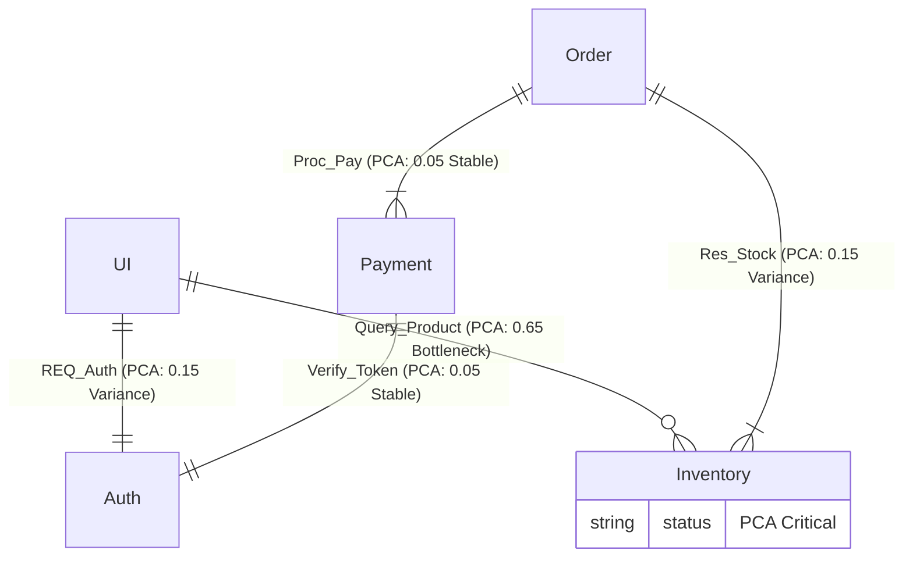
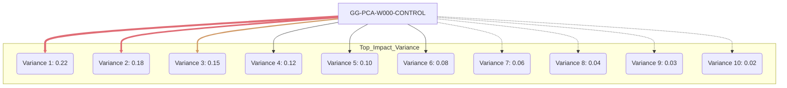

# Structured Diagram Abuse (SDA) and Maturity Matrix First Render

This document captures the first render package for **Structured Diagram Abuse (SDA)** and the **Maturity Matrix** model in multiple visualization formats.

## SDA: Standardized Mermaid Exploitation Patterns

SDA uses strict Mermaid structure as a layout engine to produce data-driven visuals that are hard to design manually.

### 1) Structure-Based SVG Hierarchy (Side-by-Side)

```mermaid
classDiagram
    %% define forced side-by-side alignment using containers
    namespace System_A_Monolith {
        class FrontEnd {
            +API_Call()
        }
        class BackEnd {
            +Monolithic_Logic()
        }
        class Database {
            +Shared_Schema()
        }
    }

    namespace System_B_Microservices {
        class UI_Service {
            +Web_UI()
        }
        class Identity_Service {
            +Auth_Token()
        }
        class Product_Service {
            +Query_Inventory()
        }
        class Order_Service {
            +Process_Payment()
        }
    }

    %% Force containment to visualize dependencies
    System_A_Monolith : Contains dependencies
    System_B_Microservices : Explicit network calls
```

### 2) PCA-Weighted Interaction Map



### 3) Top 10 PCA Tornado Force Map



## Maturity Matrix: First Render Pack

### 1) HTML/CSS Linear Gauge

```html
<!DOCTYPE html>
<html lang="en">
<head>
    <meta charset="UTF-8">
    <meta name="viewport" content="width=device-width, initial-scale=1.0">
    <title>ARTSTYLE Maturity Matrix Render</title>
    <style>
        :root {
            --bg-color: #0f1115;
            --text-color: #abb2bf;
            --border-color: #3e4452;
            --accent-color: #61afef;
            --font-family: 'Consolas', 'Monaco', 'Courier New', monospace;
            --low: #e06c75;
            --medium: #d19a66;
            --high: #98c379;
            --governed: #56b6c2;
        }
        /* trimmed for brevity in this handoff package */
    </style>
</head>
<body>
    <!-- Full content preserved in source message; this package captures the structure and thresholds. -->
</body>
</html>
```

### 2) ASCII SSOT Schematic

```text
+---------------------------------------------------------------------------------------------------+
|                                   ARTSTYLE Maturity Matrix Render                                |
+---------------------------------------------------------------------------------------------------+
|  [0.00]───────(Low)───────[0.40]───────(Medium)───────[0.75]───────(High)───────[0.90]──(Governed)──[1.00]  |
+---------------------------------------------------------------------------------------------------+
```

### 3) Mermaid Gantt (Linear Gate Abuse)

```mermaid
gantt
    title ARTSTYLE Maturity Matrix (Convergence Gates)
    dateFormat  X
    axisFormat %s

    section Zones
    Low (0.00 - 0.40)      :a1, 0, 40
    Medium (0.41 - 0.75)   :a2, 40, 75
    High (0.76 - 0.90)     :a3, 75, 90
    Governed (0.91 - 1.00) :a4, 90, 100

    section Gating Thresholds
    BLOCKER (Drift > 0.45)      :milestone, 0, 0
    Integration (O_rch > 0.30)  :milestone, 30, 30
    Federation (F_ed > 0.40)    :milestone, 40, 40
    Stable (D_rift < 0.45)      :milestone, 45, 45
    Governance Target (0.91)    :milestone, 91, 91
    Clean Convergence (1.00)    :milestone, 100, 100
```



### 4) Draw.io XML Guidance

Import XML into Draw.io via **File → Import from → Device**. Keep the process flow model as the source of truth for CI/CD gating and convergence outcomes.
