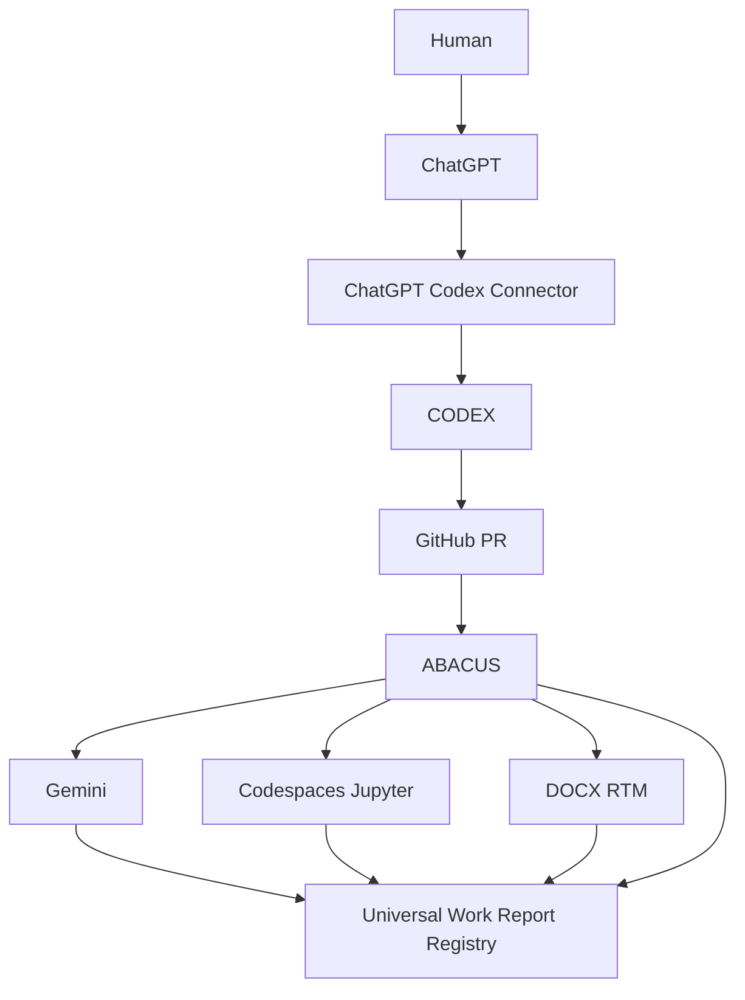

# Federation Layer

The federation layer describes how ABACUS coordinates review-first work reports across agents and tools. This is a documentation scaffold only; it does not activate production routing or external API calls.

## Registries

| Registry | Purpose | Minimum record | Owner |
| --- | --- | --- | --- |
| Federation Registry | Lists participating systems and their trust boundaries. | system id, role, allowed handoffs, report path | ABACUS governance |
| Agent Registry | Lists agent identities and review authority. | agent id, human/agent flag, allowed risk class, merge authority | ABACUS governance |
| Capability Registry | Lists capabilities available for planning and handoff. | capability id, provider, input type, output type, limitation notes | ABACUS governance |
| Contract Registry | Stores input/output contracts for bridges and tasks. | contract id, producer, consumer, schema, failure modes | ABACUS governance |
| Report Registry | Indexes Universal Work Reports for rollup and audit. | work_id, level, status, tree_sha, report URI | ABACUS governance |

## Participant representation

| Participant | Role | Registry placement | Report obligation |
| --- | --- | --- | --- |
| ChatGPT | Human-facing planning and PR-body orchestration. | Federation Registry, Agent Registry | Emits or requests Universal Work Report summary. |
| CODEX | Repository-local implementation and commit agent. | Federation Registry, Agent Registry, Capability Registry | Emits Markdown and YAML Universal Work Reports. |
| ABACUS | Governance substrate and rollup authority. | Federation Registry, Report Registry | Aggregates reports and verifies lifecycle state. |
| Gemini | External analysis/parallel reasoning participant. | Federation Registry, Agent Registry | Emits bridge-compatible Universal Work Report. |
| Jupyter/Codespaces | Notebook and interactive workspace participant. | Federation Registry, Capability Registry | Emits execution notes and report fragments. |
| DOCX_RTM | Document/requirements traceability participant. | Federation Registry, Capability Registry | Emits RTM artifacts and report references. |

## Federation graph — ASCII

```text
                    Human
                      |
                      v
                   ChatGPT
                      |
                      v
             ChatGPT Codex Connector
                      |
                      v
                    CODEX
                      |
                      v
                   GitHub PR
                      |
                      v
                    ABACUS
                      |
        +-------------+-------------+
        |             |             |
        v             v             v
     Gemini    Codespaces/Jupyter  DOCX_RTM
        |             |             |
        +-------------+-------------+
                      |
                      v
          Universal Work Report Registry
```

## Federation graph — Mermaid



## Control rules

- Reports may be aggregated across participants, but merge authority remains human-only for review-first PRs.
- Registry records must distinguish blockers from environment limitations.
- Federation handoffs must preserve work identity, parent linkage, track type, risk class, and victory criteria.
