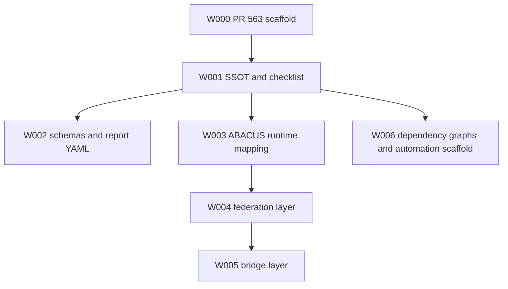

# Dependency Graphs

These graphs show PR #563 wave dependencies and allowed parallelism. They are planning artifacts only and do not execute automation.

## Dependency graph — ASCII

```text
W000 PR #563 scaffold
  |
  +--> W001 SSOT + checklist
          |
          +--> W002 schemas + report YAML
          |
          +--> W003 ABACUS runtime mapping
                    |
                    +--> W004 federation layer
                              |
                              +--> W005 bridge layer
          |
          +--> W006 dependency graphs + automation scaffold
```

## Dependency graph — Mermaid



## Parallel execution notes

- `W001` is the serial foundation for all later waves.
- `W002` and `W006` can proceed in parallel after `W001` because they depend only on SSOT assets.
- `W003 -> W004 -> W005` is serialized because runtime mapping feeds federation registries, and registries feed bridge contracts.
- All tracks reconcile through `docs/reports/PR563_WORK_REPORT.md` and `docs/reports/PR563_WORK_REPORT.yaml`.
