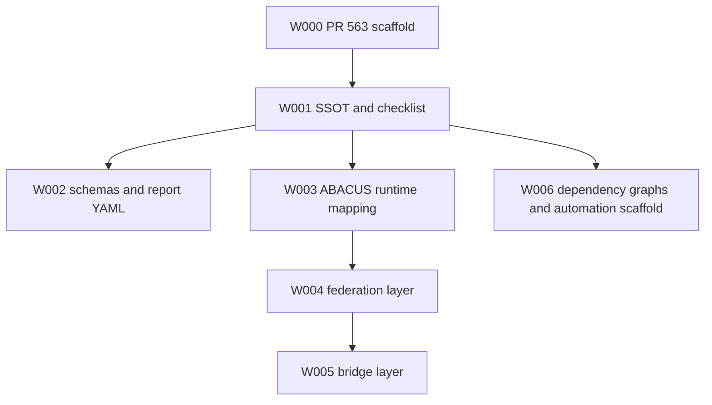
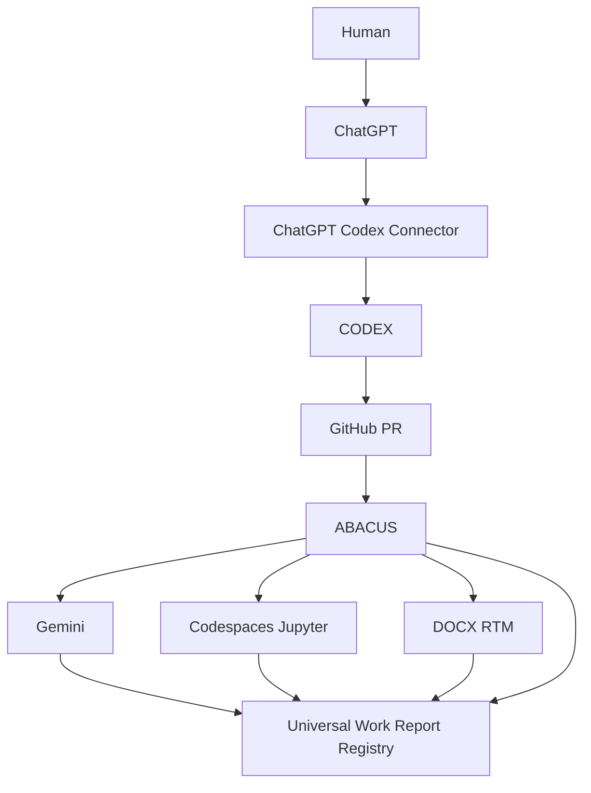

# === PR TODO :: UNIVERSAL LIFECYCLE CHECKLIST (drop-in, generic) ===
# Work top-to-bottom. Do NOT skip a phase. Do NOT merge.
# Symbols:  [ ] todo   [~] in-progress   [x] done   [!] blocked   [-] N/A
# States:   PASS | FAIL | PARTIAL | N/A   •   limitations are NEVER silent

## PHASE 0 — FRAME  (before any change)
[ ] Write INTENT (one sentence: why this PR exists)
[ ] Write GOAL (measurable, falsifiable end-state)
[ ] Define SCOPE: IN-SCOPE / OUT-OF-SCOPE / BOUNDARY rule
[ ] Set RISK_CLASS: {REVERSIBLE | IRREVERSIBLE | SECRET-SENSITIVE | EXTERNAL-EFFECT}
[ ] Map IDENTITY: WORK_ID, LEVEL (PROGRAMME→…→SUBTASK), PARENT_ID, DEPENDS_ON, BLOCKS
[ ] Declare TRACK_TYPE per task: [SEQ] serialized | [PAR] parallel
[ ] Emit FEEDFORWARD to first/child unit: intent + constraints + victory criteria

## PHASE 1 — DEFINE VICTORY  (the gate that must exist before coding)
[ ] List V1..Vn as falsifiable pass/fail criteria (NOT a task list)
[ ] Include at minimum:
    [ ] Vx: working tree clean; single coherent commit on stated base
    [ ] Vx: secret-clean (scan for keys/tokens/credentials) → no hits
    [ ] Vx: every intentional shim/exception DOCUMENTED
    [ ] Vx: legacy/ignored inputs WARNED-and-ignored, never silently dropped
    [ ] Vx: build/compile passes; smoke-run passes
    [ ] Vx: input validation / path-safety enforced (reject abs paths, traversal)
    [ ] Vx: audit/log path is append-only AND EXERCISED (not just implemented)
    [ ] Vx: all declared strategies/branches reachable AND exercised
    [ ] Vx: every skipped check labeled ENVIRONMENT-LIMITATION
[ ] Define WORK-UNTIL stop condition (= Victory met OR boundary/blocker hit)

## PHASE 2 — EXECUTE  (stay in scope)
[ ] Implement minimal change to satisfy Victory; no scope creep
[ ] Tag each task [SEQ]/[PAR]; reconcile [PAR] tracks at milestone
[ ] On any out-of-scope need → STOP, emit FEEDBACK, do not expand
[ ] Record PATCH_TYPE: {FEATURE | FIX | HARDENING | VALIDATION | NO-OP}

## PHASE 3 — VERIFY  (evidence, not assertion)
[ ] Run testing ledger; mark each ✅ PASS / ⚠️ ENV-LIMITATION / ❌ FAIL
[ ] Move every claim from IMPLEMENTED → EXERCISED → VERIFIED with evidence
[ ] Exercise audit/log write path with ONE synthetic, reversible input; then restore
[ ] Confirm reversibility: clean tree before AND after; no stray artifacts committed
[ ] Re-run any FEEDBACK-driven fixes and re-verify (close the FB loop)

## PHASE 4 — REPORT  (use Universal Work Report schema)
[ ] Fill §0 Identity/Mapping … §11 Audit/Data
[ ] Victory: tally OVERALL n/total → MET | NOT MET
[ ] Separate OPEN BLOCKERS (in-scope) from ENVIRONMENT-LIMITATIONS (never conflate)
[ ] List ARTIFACTS: runtime-only vs committed vs persistent-verified
[ ] Emit machine-readable twin (§0/§4/§11 as YAML/JSON for rollup)

## PHASE 5 — MILESTONE vs HOLD-POINT
[ ] Soft MILESTONE (tracks continue) reached? set STATUS string
[ ] Hard HOLD-POINT active? (REQUIRED if RISK_CLASS ∈ {IRREVERSIBLE, SECRET-SENSITIVE})
[ ] Confirm NO merge / NO irreversible action performed by agent

## PHASE 6 — DURABLE ANCHOR & MERGE GATE  (human-only release)
[ ] Capture content identity: tree_sha (durable), container_head_sha (ephemeral)
[ ] Flag base_ref_stable: false if commit SHA can re-hash across sessions
[ ] Rule: pin_container_sha=false; pin_remote_sha=true; merge_requires_human_go=true
[ ] HUMAN GO CHECKLIST (agent cannot tick these):
    [ ] push branch to authoritative remote
    [ ] pin remote SHA:  git rev-parse <remote>/<branch>
    [ ] verify tree:     git rev-parse <remote>/<branch>^{tree} == <tree_sha>
    [ ] tree_match == true ? → issue GO   |   differs ? → STOP
[ ] On GO, append closure record:
    merge_gate: {released_by, approved_remote_sha, verified_tree_sha, tree_match, go_issued_at}

## FINAL STATUS (one line)
status: "<PR READY FOR HUMAN REVIEW — REVIEW-FIRST ONLY | MERGED @ <remote_sha>>"

# RULES (always on)
# - No auto-merge. No scope expansion. No silent skips. No secrets committed.
# - FF/FB loops apply ONLY at PROGRAMME→WAVE→SUB-WAVE→PHASE→SPRINT→TASK→SUBTASK.
# - A unit may not START without FF input, nor CLOSE without FB output.
# - Approve durable content (tree_sha), never an ephemeral commit SHA.
# === END PR TODO ===

---

# PR #563 — Universal Work Report + PR Lifecycle Checklist SSOT

## Current wave status

| Wave | Status | Evidence |
| --- | --- | --- |
| W001 — SSOT and lifecycle checklist | PASS | Checklist SSOT, template, Universal Work Report SSOT, templates, examples, and governance index created. |
| W002 — Machine-readable schema | PASS | Universal Work Report and PR Lifecycle Checklist schemas plus PR563 YAML report created. |
| W003 — ABACUS runtime mapping | PASS | Runtime hierarchy maps PROGRAMME through SUBTASK with FF/FB and closure rules. |
| W004 — Federation layer | PASS | Federation, Agent, Capability, Contract, and Report registries documented with required participants. |
| W005 — Bridge layer | PASS | Required bridge contracts documented with input/output, failure mode, report emission, and handoff target. |
| W006 — Dependency graph and PR automation scaffold | PASS | Dependency graphs created; GitHub Actions gate documented as scaffold-only. |

## Dependency graph — ASCII

```text
W000 PR #563 scaffold
  |
  +--> W001 SSOT + checklist
          |
          +--> W002 schemas + report YAML
          |
          +--> W003 ABACUS runtime mapping
                    |
                    +--> W004 federation layer
                              |
                              +--> W005 bridge layer
          |
          +--> W006 dependency graphs + automation scaffold
```

## Dependency graph — Mermaid



## Federation graph — ASCII

```text
                    Human
                      |
                      v
                   ChatGPT
                      |
                      v
             ChatGPT Codex Connector
                      |
                      v
                    CODEX
                      |
                      v
                   GitHub PR
                      |
                      v
                    ABACUS
                      |
        +-------------+-------------+
        |             |             |
        v             v             v
     Gemini    Codespaces/Jupyter  DOCX_RTM
        |             |             |
        +-------------+-------------+
                      |
                      v
          Universal Work Report Registry
```

## Federation graph — Mermaid



## Universal Work Report summary

```yaml
schema_name: universal_work_report
schema_version: 1.0.0
work_id: PR-563
agent: CODEX
level: WAVE
parent_id: null
track_type: PAR
risk_class: REVERSIBLE
review_status: REVIEW-FIRST
merge_allowed: false
victory_overall: MET
open_blockers: []
environment_limitations: []
report_markdown: docs/reports/PR563_WORK_REPORT.md
report_yaml: docs/reports/PR563_WORK_REPORT.yaml
tree_sha: pending external verification after final commit; authoritative tree is reported in PR update
```

## Final status

```yaml
status: PR READY FOR HUMAN REVIEW - REVIEW-FIRST ONLY
merge_allowed: false
human_go_required: true
```

No merge, auto-merge, production runtime execution, external API integration, or protected-branch setting change was performed.
